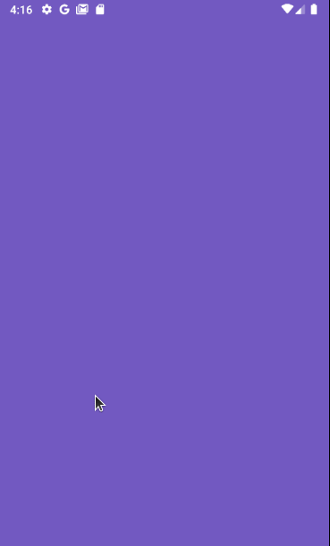

<h3 align="center">
  Desafio 04: Conceitos do React Native
</h3>

<blockquote align="center">“Sucesso não é o resultado de um jogo, mas o destino de uma jornada”!</blockquote>

  

  

  

  

  <a href="#rocket-sobre-o-desafio">Sobre o desafio</a>&nbsp;&nbsp;&nbsp;|&nbsp;&nbsp;&nbsp;
  <a href="#memo-licença">Licença</a>

  
  
  
 

## :rocket: Sobre o desafio

Nesse desafio, você deve criar uma aplicação para treinar o que você aprendeu até agora no React Native!

Agora você deve continuar desenvolvendo a aplicação que irá armazenar repositórios do seu portfólio, que você já desenvolveu o <a href="https://github.com/martins20/NodeConcepts">backend</a> utilizando o Node.js, e no <a href="https://github.com/martins20/ReactjsConcepts">último</a> desafio em ReactJS.

### Funcionalidades da aplicação

- **`Listar os repositórios da sua API`**: Deve ser capaz de criar uma lista de todos os repositórios que estão cadastrados na sua API com os campos **title**, **techs** e número de curtidas seguindo o padrão `${repository.likes} curtidas`, apenas alterando o número para ser dinâmico.

- **`Curtir um repositório listado da API`**: Deve ser capaz de curtir um item na sua API através de um botão com o texto **Curtir** e deve atualizar o número de likes na listagem no mobile.

### Específicação dos testes

Em cada teste, tem uma breve descrição no que sua aplicação deve cumprir para que o teste passe.

Caso você tenha dúvidas quanto ao que são os testes, e como interpretá-los, dé uma olhada em **[nosso FAQ](https://github.com/Rocketseat/bootcamp-gostack-desafios/tree/master/faq-desafios).**

Para esse desafio temos os seguintes testes:

- **`should add a like to the like counter of the repository`**: Para que esse teste passe, sua aplicação deve permitir ao clicar no botão `Curtir`, um like seja adicionado ao repositório listado, e que essa atualização possa ser visualizada na tela.

## :memo: Licença

Esse projeto está sob a licença MIT. Veja o arquivo [LICENSE](LICENSE) para mais detalhes.

---

Feito com 💜 by Rocketseat & Martins20
